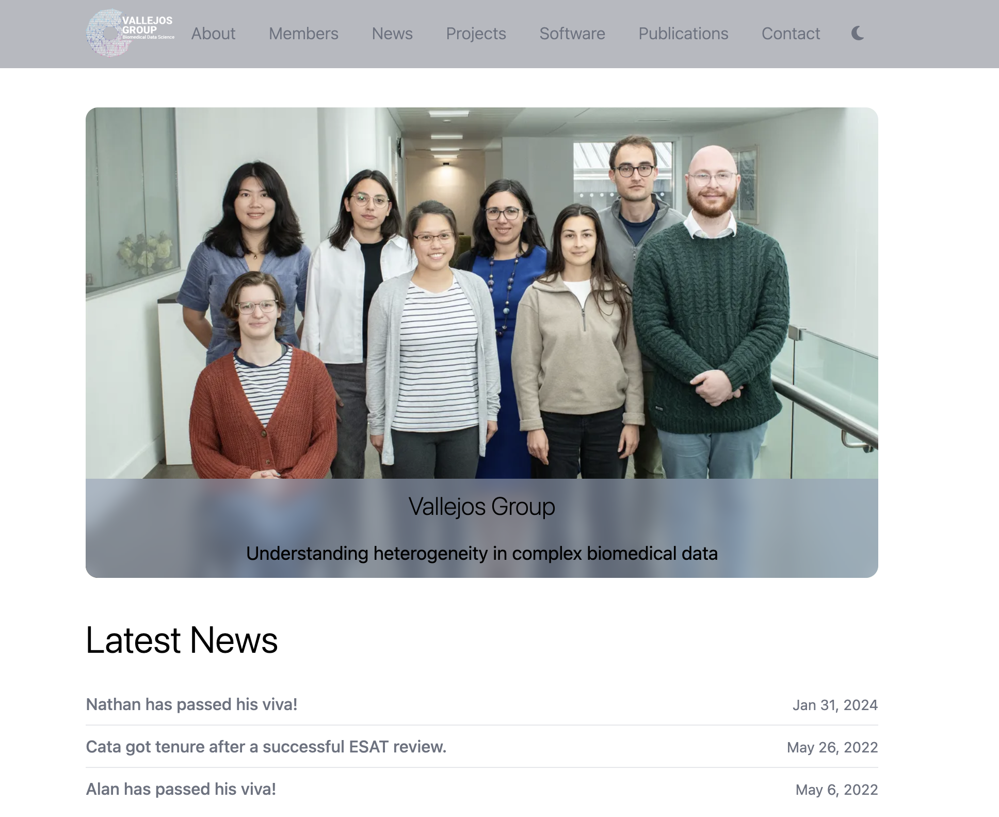

# The Vallejos Group Website 


[](https://github.com/VallejosGroup/VallejosGroup.github.io/actions/workflows/deploy.yml)



Our website is a [Jekyll](https://jekyllrb.com) site adapted from the
[al-folio](https://github.com/alshedivat/al-folio) theme to be more suitable for research
groups and to support [Tailwind CSS](https://tailwindcss.com) for responsive & modern
web-design.


 <h2>Table of Contents </h2>

- [The Vallejos Group Website](#the-vallejos-group-website)
  - [Making edits to our site](#making-edits-to-our-site)
    - [New members](#new-members)
    - [Adding publications](#adding-publications)
  - [Local setup](#local-setup)


## Making edits to our site 
:pencil2:

Our site is built using [GitHub actions]((https://github.com/features/actions)).
This means edits to the site can be made without locally building the website.
When a change is pushed to the `master` branch, a GitHub action runs which
builds the website on the `gh-pages` branch. This is then deployed to
https://vallejosgroup.github.io. If you are interested in building the website
locally so you can see the changes made to the website before they are pushed,
see the [Local setup](#local-setup) section.


### New members
:woman: :man:

Welcome to the group! There are 5 steps to follow to add your profile
to the website:

1. Clone the repo
2. Add a 3:4 aspect ratio image to `img/members`
3. Add profile to `_members/`
4. Add first and last names to the [_config.yml](_config.yml) file
5. Commit and push changes

If you have not already, clone this repository. 

Navigate to the img/members directory and add a `jpg` or `png` profile image with a
**3:4 aspect ratio**. *Note: a 3:4 aspect ratio image can be generated via
`imagemagik` using the following command* (replacing < filename > with the 
actual filename):

```bash
$ magick convert <filename>.jpg -gravity center -crop 3:4 <filename>.jpg
```

Now navigate to the _members/ directory, duplicate the
[`Nathan.md`](_members/Nathan.md) file, rename it to your own name, and edit
the file to provide your own links. For any links you do not want,
comment the line out using #. When specifying the name of the profile image do
not include the file extension.

Next, navigate to [_config.yml](_config.yml) and scroll to the Jekyll Scholar
section of the file. You should add your last name to the `last_name` array and
first names in the   `first_name` array in the format they (will) appear
in publications. If your name appears in multiple formats, add all of these
formats. Now, when a publication is added to the site which you are an
author on, your name will be underlined in the listing.  

Finally commit and push the changes. You can watch the progress of the website
being built via the [actions tab](https://github.com/VallejosGroup/VallejosGroup.github.io/actions).
Once the `Deploy` and subsequent `pages-build-deployment` workflows are
finished, your changes should be on https://vallejosgroup.github.io

### Adding publications
:books:

The [publications section](https://vallejosgroup.github.io/publications/) of the
website is generated from the [_bibliography/papers.bib](_bibliography/papers.bib)
BibTeX file. Adding a record to this file will result in the publication
being added to the website. I recommend adding an abstract to the record as this
abstract will then be visible on the website. Likewise, providing a url key will
produce a link to the manuscript on the journal's website. 

There are a few non-standard BibTeX keys used by this website. The first, `abbr`
can be used to provide a journal abbreviation which is then shown next to the
publication on the website. The second, `selected` denotes if the publication
appears on the homepage under the *Selected Publications* section. If this key
is not listed then `selected = {false}` is assumed. 

Finally, PDFs can be hosted on the website. Simply copy the PDF file to the 
`assets/pdf` directory, create a pdf key in the BibTeX file, using the name of
the pdf file, and a link will be generated.  

## Local setup
:computer:

Building our website locally requires `ruby`, and `node`. If on macOS or Linux,
there is a high chance `ruby` is already installed and may also have node
installed. To check if you have them installed, run 

``` bash 
$ ruby -v
$ node -v
``` 
Running the below commands will then download and install additional
dependencies and serve the site locally. As change are detected in the
source files, the site will automatically re-generate (*note: edits to the
config file might require re-running `bundle exec jekyll serve` in order to take
effect*) 

```bash
$ mkdir node_modules
$ npm install
$ npm install tailwindcss@3.0.0 @tailwindcss/typography@latest postcss@latest postcss-scss@latest autoprefixer@latest cssnano@latest
$ bundle install
$ bundle exec jekyll serve
```

`npm`,  the node package manager, should install the files needed for Tailwind CSS
whilst `bundle` will install the Ruby modules used by the site (as
listed in [`Gemfile`](Gemfile))
